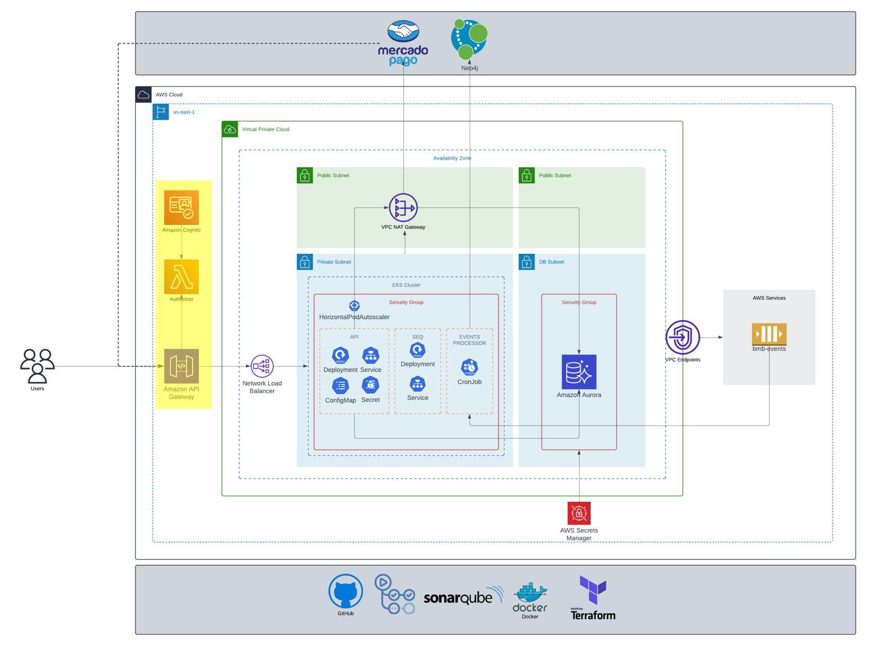

# bmb.authenticator

# API Gateway Proxy with Lambda Authorizer

This project sets up an API Gateway that acts as a proxy, using a Lambda authorizer to authenticate requests for internal resources. The API Gateway routes incoming requests to the appropriate backend services, ensuring that only authenticated requests are processed.

## Dependencies
- [VPC](https://github.com/soat-fiap/bmb.infra)    
- [NLB (Network Load Balancer)](https://github.com/soat-fiap/FIAP.TechChallenge.ByteMeBurger)

## Features

- **API Gateway Proxy**: Acts as a proxy to route requests to backend services.
- **Lambda Authorizer**: Authenticates incoming requests to ensure they are valid.
- **Internal Resource Protection**: Ensures that only authenticated requests can access internal resources.

## Prerequisites

- AWS Account
- AWS CLI configured with appropriate permissions
- Node.js and npm installed

## Terraform Resources

This project uses Terraform to create and manage the necessary AWS resources. The following resources are created:

- **aws_api_gateway_rest_api**: Defines the API Gateway.
- **aws_api_gateway_resource**: Creates resources within the API Gateway.
- **aws_api_gateway_method**: Defines methods for the API Gateway resources.
- **aws_lambda_function**: Deploys the Lambda authorizer function.
- **aws_iam_role**: Creates IAM roles for the Lambda function and API Gateway.
- **aws_iam_policy**: Attaches policies to the IAM roles.
- **aws_api_gateway_authorizer**: Configures the Lambda authorizer for the API Gateway.

### Terraform Output

After running `terraform apply`, the following outputs will be provided:

- **api_gateway_url**: The URL of the deployed API Gateway.
- **lambda_authorizer_arn**: The ARN of the deployed Lambda authorizer function.

## This repo on the infrastructure

